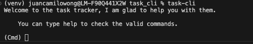
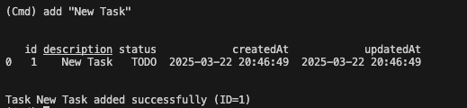
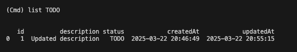
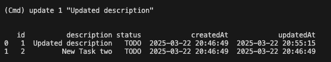
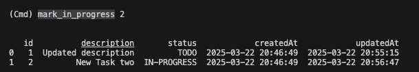
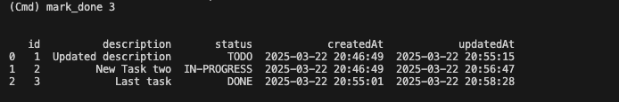
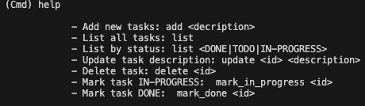

# TASK TRACKER CLI

This task tracker allows you to add, update and change the status of your daily tasks

## Usage
### Initialization
Initialization command to run the CLI
```
python3 task-cli.py
```


### Add 
Add new tasks in TODO status

ARGS:
- description
```
add "New task"
```

### List
List all your taks or list by status

ARGS:
- status or blank (list all)

```
list
```

```
list TODO
```

### Update 
Update tasks descriptions

ARGS:
- id
- description
```
update 1 "Updated description"
```

### Mark 
Mark your tak status as "IN-PROGRESS" or "DONE" using id

ARGS:
- id
```
mark_in_progress 2
```

```
mark_done 3
```

## Delete 

Remove task using id

ARGS:
- id
```
delete 1
```


## Help
Show all the commands and their arguments
```
help
```


## Contributors

- [@juancamilowong](https://www.github.com/juancamilowong)

## Project source

This is a project from [Roadmap](https://www.roadmap.sh). Click this [link](https://roadmap.sh/projects/task-tracker) to checkout the project